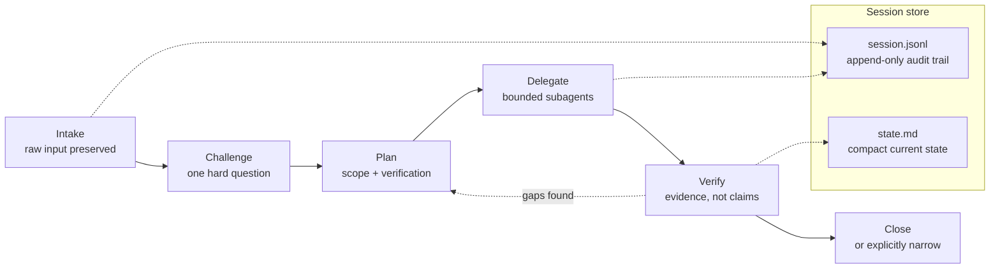
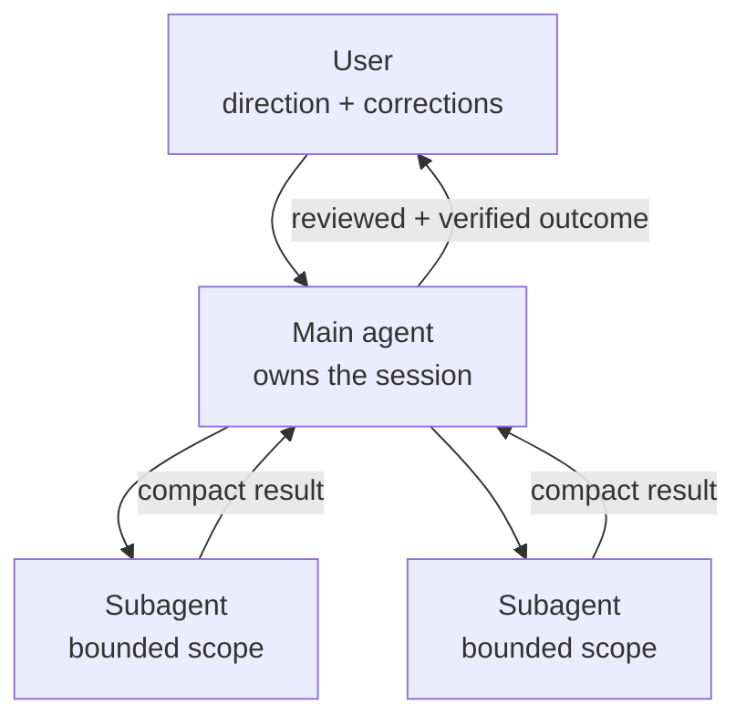

# Stellwerk Starter

Stellwerk Starter is a small reference repo for building a personal coding-agent
runtime.

It is not a framework, product, or package. The useful part is the operating
model:

- keep a compact always-on identity and work policy
- move deeper procedures into skills
- use a session orchestrator for larger work
- separate research, meeting recap, implementation, review, and verification
- store durable private context deliberately, not everywhere

## Start Here

If you are a human: skim this README, then decide whether this model fits your
workflow.

If you are a coding agent: read [AGENTS.md](AGENTS.md) first. That file tells
you how to adapt this starter into your user's setup.

## Who This Is For

This folder is meant for someone who already uses coding agents and wants a
clearer personal runtime without copying another person's private setup.

Good fit:

- you use agents for coding, research, writing, or meeting follow-up
- larger tasks drift across many turns
- you want the agent to coordinate subagents instead of making you do it
- you want raw input, decisions, friction, and verification captured clearly
- you want reusable workflows without exposing private context

Bad fit:

- you only need a single short prompt
- your runtime cannot load any conditional instructions
- you want a prebuilt package instead of adapting the ideas
- you are not willing to review the instructions before using them

## Suggested Repo Name

Use `stellwerk-starter`.

Why:

- short and clear
- close enough to the original idea
- does not imply a finished product or framework
- easy to fork into a personal runtime

`stellwerk-template` would sound more copy-pasteable than intended. `stellwerk`
alone should stay reserved for a real personal implementation.

## Core Workflow

The central workflow is `Leitstand`: a main-agent mode for substantial work.

In that mode the agent should:

- preserve important raw user input
- define the goal and success criteria
- delegate bounded work to subagents where useful
- keep the main thread focused on decisions and integration
- log friction when the process fails or the user has to correct course
- verify before calling the work complete

That is the heart of Stellwerk Starter. Everything else supports it.

### How a session runs

The phases are a state machine, not a waterfall — the agent moves back and
sideways when the conversation demands it. Every phase writes into the session
store.



The two artifacts have different jobs. The JSONL log is the audit trail —
append-only, with the user's original input stored verbatim before any
summarizing happens. The state file is working memory: the compact current
state a fresh chat, a resumed session, or a worker agent reads first instead
of replaying the whole conversation. That split is what makes a session
survive context compaction.

### Who coordinates whom



Subagents produce inputs. They never own the goal, never lower the quality
bar, and never replace final review. The rule that makes the model work:
the agent never hands coordination back to the user for work that belongs
inside the session.

## File Map

Start here:

- [AGENTS.md](AGENTS.md): agent-facing adaptation instructions
- [architecture.md](architecture.md): runtime structure and boundaries
- [privacy-and-sharing.md](privacy-and-sharing.md): what must stay out

Base layer:

- [identity/role-and-tone.md](identity/role-and-tone.md): compact always-on identity
- [work-policy/execution.md](work-policy/execution.md): action and follow-through rules
- [work-policy/verification.md](work-policy/verification.md): proof-before-done policy
- [work-policy/privacy.md](work-policy/privacy.md): privacy boundary for runtime work
- [work-policy/change-workflow.md](work-policy/change-workflow.md): scoped change flow

Core skill blueprints:

- [skills/leitstand.md](skills/leitstand.md): session orchestration
- [skills/research.md](skills/research.md): source-backed research
- [skills/meeting-recap.md](skills/meeting-recap.md): transcript and notes recap
- [skills/challenge.md](skills/challenge.md): planning challenge mode
- [skills/implementation.md](skills/implementation.md): focused implementation slices
- [skills/dev-review.md](skills/dev-review.md): review and quality gate
- [skills/verification.md](skills/verification.md): evidence-before-done

Optional skill blueprints:

- [skills/prompt-design.md](skills/prompt-design.md): prompt and instruction quality
- [skills/functional-writing.md](skills/functional-writing.md): durable technical and decision-oriented text
- [skills/person-context.md](skills/person-context.md): durable communication context

## What Not To Adapt

Do not import someone else's:

- personal biography or family context
- stakeholder/person library
- customer names, company workflows, or infrastructure paths
- secrets, vault keys, bot names, SSH aliases, hostnames, or tokens
- meeting transcripts, raw dictations, or session logs
- provider-specific hacks that your runtime does not support

Those are local context, not reusable runtime design.

## Minimal Implementation Plan

Ask your coding agent to implement only the first useful slice:

1. Create a concise agent identity and work policy.
2. Add one orchestrator skill based on `skills/leitstand.md`.
3. Add one verification skill based on `skills/verification.md`.
4. Add either `research` or `meeting-recap`, whichever you need first.
5. Run a small real task through the new setup.
6. Adjust from evidence, not from imagined future needs.

## Copy-Paste Goal For A Coding Agent

```text
Use the Stellwerk Starter folder as reference material, not as a package to copy.
Read AGENTS.md first, then README.md, architecture.md, privacy-and-sharing.md,
and the relevant skill blueprints. Inspect my current agent/runtime setup and
propose a small adaptation plan. Explain what Stellwerk-style runtime structure
means in my environment, identify which workflows are worth adopting first, and
implement only the selected first slice after I approve it. Do not import private
context, customer/company instructions, secrets, raw meeting logs, or another
person's identity text.
```
