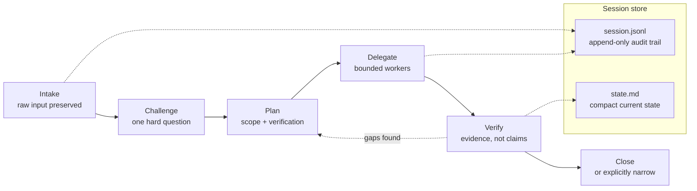

# Stellwerk Starter

Point your coding agent at this repo and it will interview you, then build you a
working agent runtime: a compact always-on identity, a work policy that decides
when it acts and when it asks, and a set of skills that load only when they are
relevant.

Not a framework, not a package, nothing to install with a package manager. It is
a set of adaptable sources plus the procedure an agent follows to fit them to
you.

## Start

Give your agent this:

```text
Read AGENTS.md in this repository and run the install for me.
```

That is the whole entry point. The agent will:

1. **Detect** your runtime, your existing instructions, your repo, your test command.
2. **Interview** you — one round, eight blocks, every one with a recommended default.
3. **Write a profile** recording every decision, then show you the plan.
4. **Install** the layers and the skills you picked, adapted to your language and stack.
5. **Verify** it — file structure, skill routing, and one real task.
6. **Report** what exists, what it proved, and what it deliberately left out.

Twenty minutes if you engage with the questions. Five if you say "defaults are
fine".

## What You Get

```text
identity/        role, tone, non-negotiables            always loaded, ~40 lines
work-policy/     act/ask, verification, coding, routing  always loaded, ~120 lines
skills/          full procedures                         loaded when relevant
context/         people, projects, customers             loaded on demand
```

The always-on layer is a routing table, not a manual. Everything a competent
agent needs only sometimes lives in a skill. That separation is the entire idea
— and flattening it back into one long prompt is the failure this repo exists to
prevent.

## The Core Workflow

`leitstand` — a German word for a control room — is a session mode for work too
big to hold in one turn. Long dictations, multi-component changes, anything that
will still be running after your context window is compacted.



The two artifacts do different jobs. The JSONL log is the audit trail —
append-only, your original words stored verbatim before anything summarizes
them. The state file is working memory: the compact current state a fresh chat,
a resumed session, or a worker reads *instead of* replaying the conversation.
That split is what makes a session survive context compaction.


Workers produce inputs. They never own the goal, never lower the quality bar,
and never replace final review. The rule that makes it work: the agent does not
hand coordination back to you for work that belongs inside the session.

## Good Fit / Bad Fit

**Good fit** if you already use coding agents daily, your longer tasks drift
across many turns, you want the agent to coordinate its own subagents, and you
would rather adapt ideas than adopt someone else's private setup.

**Bad fit** if you only need one short prompt, your runtime cannot load anything
conditionally, you want a prebuilt package, or you are not willing to read the
instructions before running them. That last one matters: this material tells an
agent how to act on your machine.

## Map

Agent-facing, in read order:

- [AGENTS.md](AGENTS.md) — the install contract
- [install/procedure.md](install/procedure.md) — six phases
- [install/runtimes.md](install/runtimes.md) — where files go, per runtime
- [install/interview.md](install/interview.md) — the questions
- [install/profile.md](install/profile.md) — the decision record
- [install/verify.md](install/verify.md) — the three checks

Sources to adapt:

- [identity/role-and-tone.md](identity/role-and-tone.md)
- [work-policy/](work-policy/) — execution, verification, coding, routing, privacy
- [skills/README.md](skills/README.md) — **read this before writing any skill**
- [skills/leitstand/](skills/leitstand/) — the worked example: references, scripts, evals
- ten more skills: verification, implementation, code-review, dev-review,
  challenge, research, meeting-recap, prompt-design, functional-writing,
  person-context

Background:

- [architecture.md](architecture.md) — why the layers exist and where a line goes
- [privacy-and-sharing.md](privacy-and-sharing.md) — what must never leave your machine

## What Not To Import

Never take another person's biography, stakeholder library, customer names,
company workflows, infrastructure paths, secrets, vault keys, bot handles,
hostnames, meeting transcripts, or session logs. None of it is reusable runtime
design; all of it is somebody's private operating context.

This repo contains none of it, deliberately. Keep it that way in yours.

## If You Would Rather Do It By Hand

1. Write a concise identity and work policy. Keep both short.
2. Add `leitstand` for orchestration.
3. Add `verification` for proof-before-done.
4. Add whichever third skill matches your actual week.
5. Run a real task through it.
6. Adjust from evidence, not from imagined future needs.

Three skills that fire reliably beat eleven that sit on disk.
